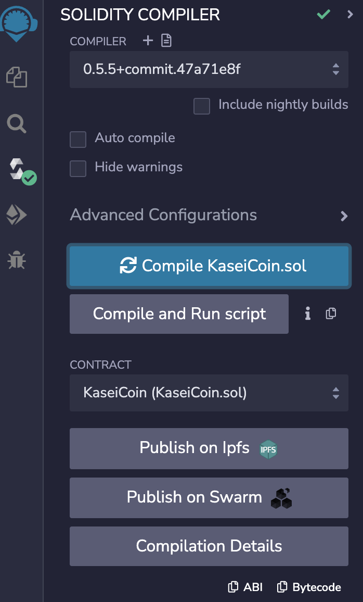
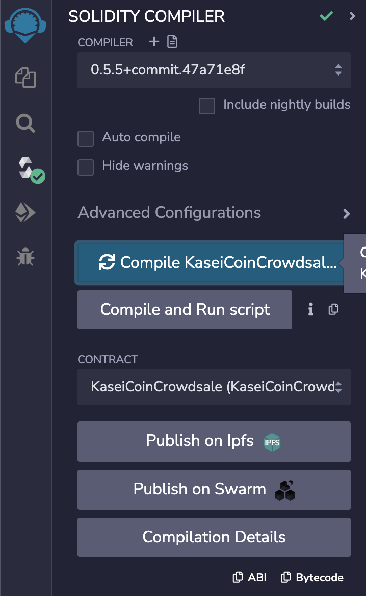
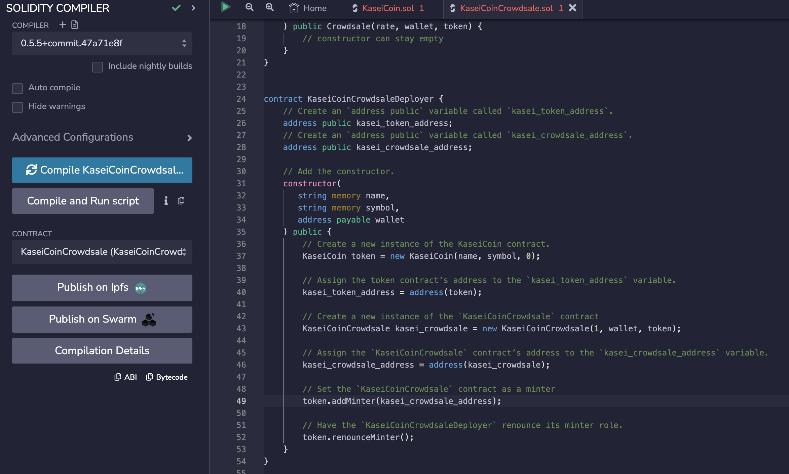

# Challenge 21 Assignment

## <ins>**Evaluation Evidence</ins>

Please see below the successful compilation of the KaseiCoin Token Contract.

Please see below the successful compilation of the KaseiCoin Crowdsale Contract.

Please see below the successful compilation of the KaseiCoin Deployer Contract. 

## <ins>** Deploy the Crowdsale to a Local Blockchain</ins>

There are three sections that require a short video or screenshots that illustrate each one. I elect to show video. Each section will have the accompanying file name that is a part of the assignment repository as evidence of completion. 

### Deploy the crowdsale to a local blockchain with Remix, MetaMask, and Ganache

Video: crowdsale_deploy.mov

### Buy new tokens and then checking the balances associated with those accounts

Video: buy_tokens.mov

### View the total supply of minted tokens and the amount of wei raised in the crowdsale

Video: total_supply_and_wei_raised.mov

